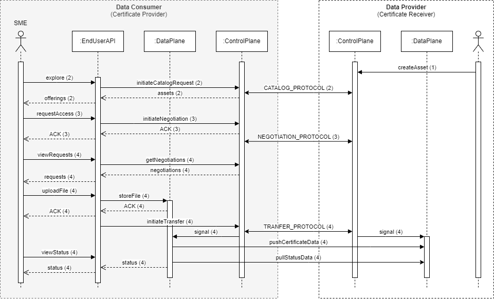

# Backend Integration

## Sequences

[//]: # (Do we need to implement the same flow as Catena-X? Their use case implementation includes two offers.)




_Figure 1. Technical push sequence_


_Figure 2. Technical pull sequence_

## APIs

### Consumed Endpoints

#### Integration of Connector API

[//]: # (Integration of EDC MVD)

#### Integration of Onboarding API

[//]: # (Integration of MSP API)
[//]: # (Who implements this?)

### Provided Endpoints

#### Notification

The application must be notified about onboarding status updates. A push approach provides the following advantages:
- Lower bandwidth consumption
- Real-time user experience / responsiveness
- Scalability and resource-efficiency

Therefore, the application implements the following endpoint:

POST `/api/notifications`

Request body:
```json
{
  "@type": "OnboardingProcess",
  "dataspaceId": {{DATASPACE_ID}},
"status": {{STATUS}}
}
```
Schema:

```json        
{
  "$schema": "http://json-schema.org/draft/2019-09/schema",
  "$id": "https://example.com/schemas/onboarding-process.json",
  "title": "OnboardingProcess",
  "type": "object",
  "properties": {
    "@type": {
      "type": "string",
      "const": "OnboardingProcess"
    },
    "dataspaceId": {
      "type": "string"
    },
    "status": {
      "type": "string",
      "enum": ["APPROVED", "DECLINED"]
    }
  },
  "required": ["@type", "dataspaceId", "status"],
  "additionalProperties": false
}
```

Notes: The dataspace registration steps that require manual checks and approvals are mocked for the on-stage demo.
