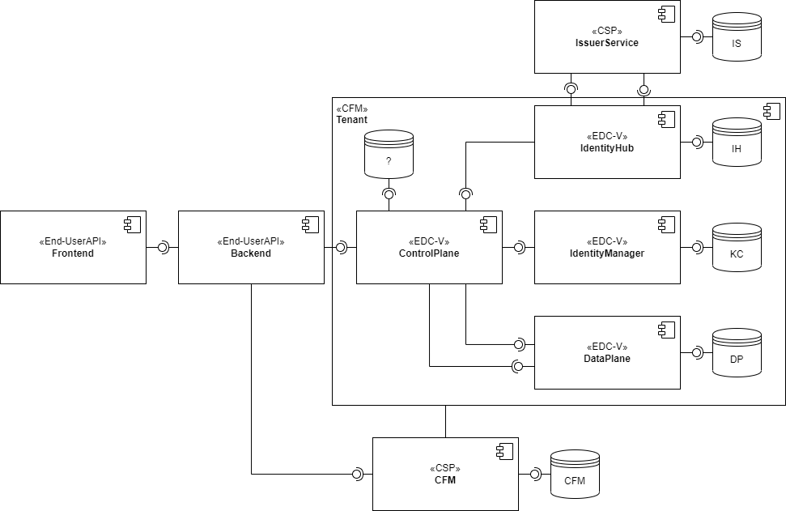
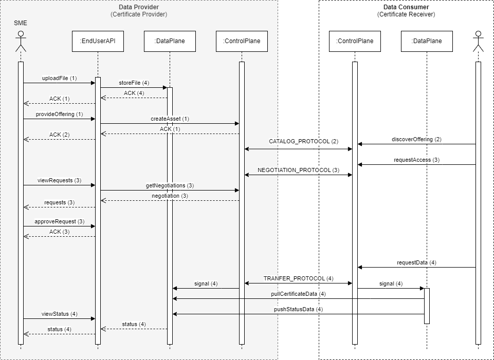

# Technical components

We divide the implementation into two features: (1) onboarding and (2) data provisioning.

_Figure 1. Component diagram_

## Interactions

### Onboarding

After entering the company data and requesting access to the dataspace, the participant is technically onboarded.

See [CFM interactions](https://github.com/Metaform/jad?tab=readme-ov-file#5-prepare-the-data-space).

### Data Provisioning

This use case implements the [pull sequence](use-case.md#pull). The SME acts as the data provider and another party acts as the data consumer, that downloads the provided certificate data. Figure 1 depicts a high-level interaction flow.

_Figure 1. Representative pull sequence_

| # | What                                           | Who            |
|---|------------------------------------------------|----------------|
| 1 | Prepare & publish data offering                | Provider (SME) |
| 2 | Establish connection _(negotiate agreement)_   | Consumer       |
| 3 | Approve access request _(negotiate agreement)_ | Provider (SME) |
| 4 | Download certificate data                      | Consumer       |

_Table 1. Steps for providing certificate data. Step 3 is not part of the demonstrator._

See [EDC-V interactions](https://github.com/Metaform/jad?tab=readme-ov-file#seeding-the-provider).

### APIs

In the following, we only list the APIs that are required to onboard the participant and provide a data offering. The demonstration requires to implement all endpoints of EDC-V and Connector Fabric Manager (CFM).

#### Backend

_Note: These interfaces must be implemented._

| # | Steps                   | Comment                                                                       | Endpoint |
|---|-------------------------|-------------------------------------------------------------------------------|----------|
| 1 | Get list of dataspaces  | names, agreements                                                             |          |
| 2 | Create registration     | company data, files, agreements                                               |          |
| 3 | Get registration data   | incl. membership status                                                       |          |
| 4 | Get list of partners    | name, VAT, country, sector                                                    |          |
| 5 | Create file             | name, description, file, access (use case, partner))                          |          |
| 6 | Get list of files       | name, description, tag, filetype, filesize, last modified, access information |          |
| 7 | Get file details        | incl. agreement and transaction history                                       |          |
| 8 | Get registration status | active, pending, inactive                                                     |          |

_Table 2. Endpoints for GUI interactions_

#### CFM

See [Bruno collection](https://github.com/Metaform/jad/tree/main/requests/EDC-V%20Onboarding/CFM%20-%20Provision%20Provider).

| # | Steps                      | Endpoint                                                              |
|---|----------------------------|-----------------------------------------------------------------------|
| 1 | Create tenant              | {{tmBaseUrl}}/api/v1alpha1/tenants                                    |
| 2 | Deploy participant profile | {{tmBaseUrl}}/api/v1alpha1/tenants/{{tenant_id}}/participant-profiles |

_Table 3. Endpoints for connector management with CFM_

#### EDC-V

The End-User API's backend implements the provider API of the EDC-V. See [Bruno collection](https://github.com/Metaform/jad/tree/main/requests/EDC-V%20Onboarding/EDC-V%20Management/Prepare%20Provider%20Participant).

| # | Steps                      | Endpoint                                                                         |
|---|----------------------------|----------------------------------------------------------------------------------|
| 1 | Upload certificate         | {{baseURL}}/app/internal/api/control/certs                                       |
| 2 | Create asset               | {{baseURL}}/cp/api/mgmt/v4alpha/participants/{{provider_id}}/assets              |
| 3 | Create policy definition   | {{baseURL}}/cp/api/mgmt/v4alpha/participants/{{provider_id}}/policydefinitions   |
| 4 | Create contract definition | {{baseURL}}/cp/api/mgmt/v4alpha/participants/{{provider_id}}/contractdefinitions |

_Table 4. Endpoints for connector interactions_

#### JAD

Other endpoints are implemented. See [Bruno collection](https://github.com/Metaform/jad/tree/main/requests/EDC-V%20Onboarding/EDC-V%20Management/Data%20Transfer/Http%20Certs/Provider).

| # | Steps                              | Endpoint                                           |
|---|------------------------------------|----------------------------------------------------|
| 1 | Querying uploaded certificate data | {{baseURL}}/app/internal/api/control/certs/request |

_Table 5. Endpoints for certificate management with JAD_

## Transformers

The backend must transform user input into backend requests (to CFM and EDC-V).

- registration data must be mapped to CFM requests
- file upload data must be mapped to EDC-V requests

## Persistence

Required repositories for persistency, provided by the JAD database server (see [here](https://github.com/Metaform/jad?tab=readme-ov-file#components)).

- tenants _(CFM database)_
- credentials _(IdentityHub database, IssuerService database)_
- assets _(? JAD)_
- policy definitions _(? JAD)_
- contract definitions _(? JAD)_
- vault data _(Hashicorp Vault)_
- certificate files (incl. metadata) _(? JAD)_
- participants _(backend)_
- registration data _(? backend)_
  - company data 
  - dataspace data 