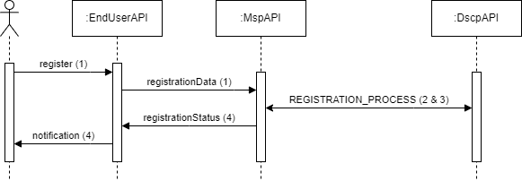
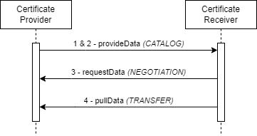
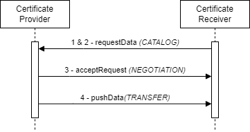
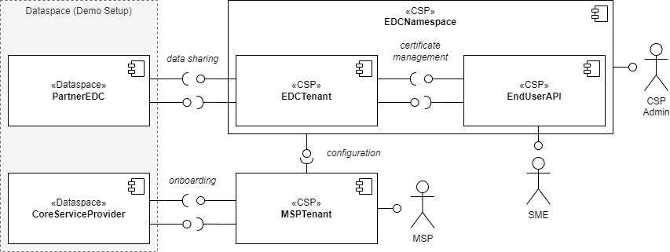

# Certificate Management Use Case

This demonstrator showcases the sharing of certificate data with dataspace technologies. This includes the onboarding process of a company to a dataspace for sharing and consuming data. We focus on the onboarding of small and medium-sized enterprises (SMEs).

## Scenario

Business transaction require company certificates. Companies can issue, request, accept, or reject certificates by using dataspace technologies, enabling interoperable and trusted certificate sharing and reducing fragmentation across multiple systems.

### Roles

The use case involves four _abstract_ roles: the Cloud Service Provider (CSP), the Managed Service Provider (MSP), the Dataspace Core Service Provider (DCSP), and the SME.

_Note: The specific characteristics of the personas involved depend on the respective use case and dataspace. See [here](requirements.md#personas) for end-user personas. The following set of user stories do not include any acceptance criteria._

#### Cloud Service Provider

The CSP provides the infrastructure and dataspace technologies as a service.

| #     | Title                          | As a | I want                                                       | So that                                                                           |
|-------|--------------------------------|------|--------------------------------------------------------------|-----------------------------------------------------------------------------------|
| US-01 | Observability                  | CSP  | to monitor dataspace services with metrics, logs, and traces | I can diagnose issues quickly und ensure reliability                              |
| US-02 | Compliance                     | CSP  | to monitor policy violations                                 | I can demonstrate compliance                                                      |
| US-03 | Data sharing                   | CSP  | to share datasets across tenants                             | I can enable collaborations without duplicating data oder exposing sensitive data |
| US-04 | Authentication & authorization | CSP  | to define access policies                                    | I ensure only authorized users can access services and data                       |
| US-05 | Deployment                     | CSP  | to automate end-to-end deployment of dataspace services      | I can deploy reliably, repeatedly, and with fast rollback if issues arise         |

_Table 1. User stories of the CSP_

#### Managed Service Provider

The MSP provides services such as dataspace onboarding or data sharing.

| #     | Title                | As a | I want                                                       | So that                                           |
|-------|----------------------|------|--------------------------------------------------------------|---------------------------------------------------|
| US-06 | Dataspace onboarding | MSP  | to onboard a new customer into the dataspace                 | the customer can participate in data sharing      |
| US-07 | Customer management  | MSP  | to maintain up-to-date contact information for each customer | communications and support reach the right person |
| US-08 | SME portal           | MSP  | to provide the costumer with access to a portal              | the customer can manage their data and use cases  |

_Table 2. User stories of the MSP_

#### Company (SME)

A company wants to connect to their business partners and share data.

| #     | Title          | As a | I want                                                                   | So that                                                                 |
|-------|----------------|------|--------------------------------------------------------------------------|-------------------------------------------------------------------------|
| US-11 | Registration   | SME  | to register to a dataspace                                               | so that I can interact with my business partners                        |
| US-12 | Data discovery | SME  | to search and discover datasets across multiple data sources and regions | I can find relevant data quickly without manual hopping between systems |
| US-13 | Compliance     | SME  | to upload use case data                                                  | so that I comply with requirements from my business partners            |

_Table 3. User stories of the SME_

#### Dataspace Core Service Provider

The DCSP provide core services of a dataspace / ecosystem.

_Note: In the Catena-X ecosystem, this is the Core Service Provider._

| #     | Title        | As a | I want                                                | So that                                                       |
|-------|--------------|------|-------------------------------------------------------|---------------------------------------------------------------|
| US-09 | Registration | DCSP | to register a new organization into the dataspace     | it can participate in the ecosystem                           |
| US-10 | Conformity   | DCSP | to validate and verify company data during onboarding | only verified organizations are granted access to the network |

_Table 4. User stories of the DCSP_

### Processes

_Note: We do not describe business processes in the following, e.g., population and processing of sales pipelines._

#### Pre-processes

- Provisioning of a service offering (e.g., dataspace (technologies) as a service, onboarding to a dataspace)
- Technical onboarding of the MSP (e.g., namespace creation in CSP infrastructure, tenant creation, access to interfaces)
- Technical onboarding of the SME (e.g., tenant creation in CSP infrastructure, access to interfaces)

#### Dataspace onboarding

An SME wants to join a dataspace. The MSP service is used for this purpose.
_Note: The MSP could be an Onboarding Service Provider in the Catena-X ecosystem._

_Figure 1. Simplified onboarding sequence_

| # | What                                                | Who  |
|---|-----------------------------------------------------|------|
| 1 | Apply for dataspace registration                    | SME  |
| 2 | Request registration at dataspace                   | MSP  |
| 3 | Approve registration at dataspace                   | DCSP |
| 4 | Notify SME about the registration status (approval) | MSP  |

_Table 5. Steps for the dataspace onboarding process_

[//]: # (Questions: Will the MSP be the CX Onboarding Service Provider?)

#### Data sharing

In this use case, the SME is the central actor. The counterparty can be any partner company that the SME interacts with.

_PULL_

In this scenario, the certificate provider is the data provider and the certificate receiver is the data consumer.

_Figure 2. Simplified pull sequence. The offering is a dataset that describes the API for downloading certificate data._

| # | What                                           | Who            |
|---|------------------------------------------------|----------------|
| 1 | Create data offer for certificate management   | Provider (SME) |
| 2 | Discover data offer for certificate management | Consumer       |
| 3 | Establish connection _(negotiate agreement)_   | Consumer       |
| 4 | Download certificate data                      | Consumer       |

_Table 6. Steps for providing certificate data_

_PUSH (Alternative)_

In this scenario, the certificate receiver is the data provider and the certificate provider is the data consumer. 

_Figure 3. Simplified push sequence. The offering is a dataset that describes the API for pushing certificate data._

| # | What                                           | Who            |
|---|------------------------------------------------|----------------|
| 1 | Create data offer for certificate management   | Provider       |
| 2 | Discover data offer for certificate management | Consumer (SME) |
| 3 | Establish connection _(negotiate agreement)_   | Consumer (SME) |
| 4 | Upload certificate data                        | Consumer (SME) |

_Table 7. Steps for providing certificate data on request_

## Overall Technical Components

The _abstract_ technical setup for the use case is separated into two environments: the _dataspace_ and the _CSP infrastructure_, as depicted in Figure 3. Both the MSP and the SME have access to the infrastructure via provided (graphical) interfaces. 

We focus on four basic interactions:

1. The SME uses the End-User API for **certificate management**.
2. The EDC tenant is connected to a partner's EDC in the dataspace for **data sharing** (provisioning & consumption).
3. The MPS tenant has a connection to the EDC tenant for **configuration** purposes (e.g., initiate setup, onboarding information).
4. The MSP tenant realizes the technical **onboarding** to the dataspace.

_Note: The technical setup of namespaces and tenants in the CSP infrastructure is not further detailed in this picture._

_Figure 4. Simplified technical setup of components_

Description of services:

- The CSP provides an infrastructure (**EDC namespace**) incl. an EDC tenant (Connector, Identity Hub) and an End-User API to manage certificates.
- The CSP provides an API to manage the infrastructure.
- The CSP provides a UI to access the MSP tenant.
- The MSP tenant integrates into the EDC namespace.
- The MSP tenant implements the API to register companies to the dataspace.
- The EDC tenant provides an API to share data.
- The EDC tenant implements the API to share data.

## User Journey

_To be added (screenshots)_