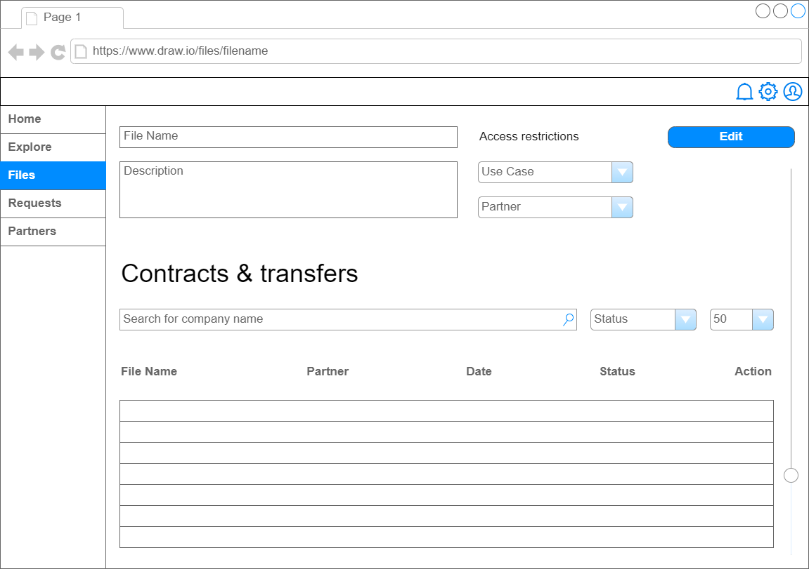
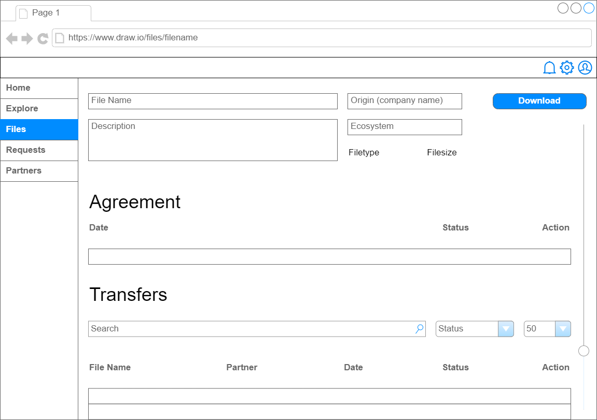
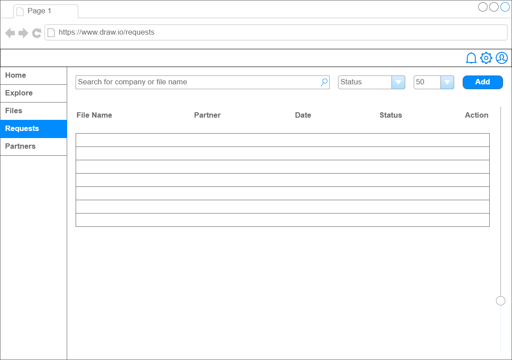
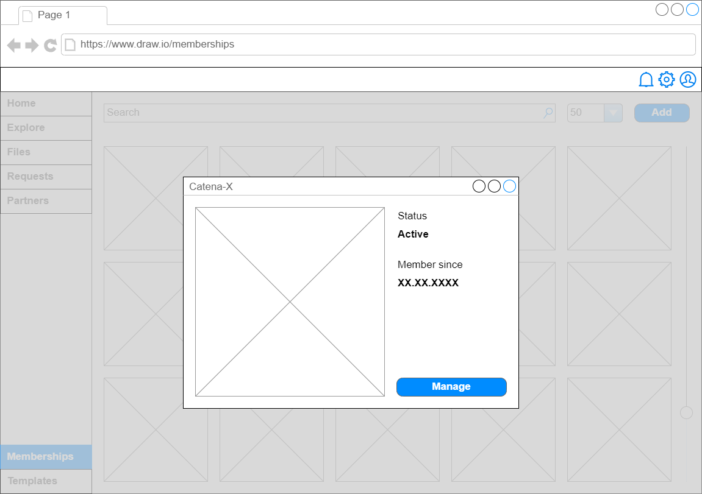
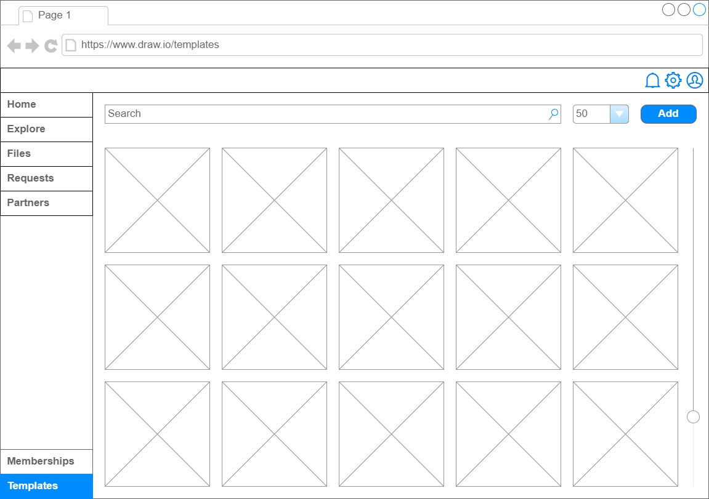

# Wireframes

* [Welcome](#welcome)
* [Register company](#register-company)
  * [Insert company data](#insert-company-data)
  * [Upload documents _(optional)_](#upload-documents-_optional_)
  * [Accept conditions](#accept-conditions)
  * [Submit registration](#submit-registration)
* [Share data](#share-data)
  * [Use case selection _(optional)_](#use-case-selection-_optional_)
  * [Upload file](#upload-file)
  * [View files](#view-files)
  * [View file details](#view-file-details)
* [Discover data](#discover-data)
* [Manage requests](#manage-requests)
* [Manage partners](#manage-partners)
* [Other Views](#other-views)
  * [Manage memberships](#manage-memberships)
  * [Templates](#templates)
  * [Notifications](#notifications)
 
## Welcome

When entering the UI for the first time (i.e. no dataspace is configured), the user can select a dataspace they want to connect to.

_Figure 1. Welcome page_

| #    | Feature                                   | Element      | Validation                                      |
|------|-------------------------------------------|--------------|-------------------------------------------------|
| F-01 | The user can search a list of dataspaces. | Search field | -                                               |
| F-02 | The user can select a dataspace.          | Drop down    | -                                               |
| F-03 | The user can submit the selection.        | Button       | The user MUST select one dataspace to continue. |

_Table 1. Features for the "welcome page" frame_

## Register company

If the company already has an identifier that is requested by the dataspace, this can be entered here. 

_Figure 2. Registration page_

| #    | Feature                                   | Element      | Validation                                      |
|------|-------------------------------------------|--------------|-------------------------------------------------|
| F-01 | The user can search a list of dataspaces. | Search field | -                                               |
| F-02 | The user can select a dataspace.          | Drop down    | -                                               |
| F-03 | The user can submit the selection.        | Button       | The user MUST select one dataspace to continue. |

_Table 1. Features for the "welcome page" frame_

Notes:
- How to avoid that someone else pretends to be affiliated with the company since no user data is processed in this registration? 

### Insert company data

The user can insert company data such as name and address.

_Figure 3. Company data page_

Notes:
- The data to be inserted could be state-specific. Thus, a selector of the location of the headquarters could be placed before this step.

### Upload documents _(optional)_

The user can upload document to proof the company information, e.g., anxtract from the commercial register.

_Figure 4. Upload proofs page_

### Accept conditions

The user can view and accept the terms and conditions for the ecosystem participation.

_Figure 5. Terms and conditions page_

### Submit registration

The user can view a summary of the registration data and submit their registration.

_Figure 6. Submission page_

## Share data

### Use case selection _(optional)_

home screen

### Upload file

Select what company should see this; framework agreement is default (in background)

_Figure 6. Submission page_

_Figure 6. Submission page_

_Figure 6. Submission page_

_Figure 6. Submission page_

Notes:
- Contract and policy definition are not shown (they could be part of an admin page) 

### View files

A list of provided and downloaded files with use case label and origin

_Figure 6. Submission page_

### View file details

_Figure 6. Submission page_

_Figure 6. Submission page_

Notes:
- Show agreements and transfers per asset

## Discover data

Searches the entire ecosystem with a federated catalog (filter for company and use case).

_Figure 9. Membership details page_

_Figure 9. Membership details page_

## Manage requests

The user can view outgoing requests (initiated negotiations in view `Explore`) and incoming requests (contract requests for `Files`).

_Figure 9. Membership details page_

| #    | Feature                                                                              | Element      | Validation |
|------|--------------------------------------------------------------------------------------|--------------|------------|
| F-01 | The user can view the details of the agreement.                                      | Pop up       | -          |
| F-02 | The user can search for negotiations according to the file name or business partner. | Search field | -          |
| F-02 | The user can filter the negotiations according to their status.                      | Drop down    | -          |
| F-03 | The user can accept requests (negotiations in state `REQUESTED`).                    | Button       | -          |

_Table 1. Features for the "welcome page" frame_

Notes:
- This view lists all negotiation objects without technical details such as ID.
- The user can trigger a status transition.

## Manage partners

The user can add partner company details for quick selection in other views.

_Figure 9. Membership details page_

## Other Views

### Manage memberships

_Figure 7. Membership page_

_Figure 8. Membership details page_

_Figure 9. Membership details page_

### Templates

The user can manage templates, e.g., for policies (_policy definitions_).

_Figure 9. Membership details page_

### Notifications

The user can see incoming notifications as a popup. 

_Figure 9. Membership details page_