# Wireframes

* [User Walkthrough](#user-walkthrough)
* [Registration](#registration)
  * [Select dataspace](#select-dataspace-)
  * [Register company](#register-company)
    * [Insert company data](#insert-company-data)
    * [Upload documents](#upload-documents)
    * [Accept conditions](#accept-conditions)
    * [Submit registration](#submit-registration)
* [Manage ecosystem](#manage-ecosystem)
  * [Manage memberships](#manage-memberships)
  * [Manage partners](#manage-partners)
* [Share data](#share-data)
  * [Use case selection](#use-case-selection)
  * [Upload file](#upload-file)
  * [View files](#view-files)
  * [View file details](#view-file-details)
* [Discover data (optional)](#discover-data-optional)
* [Notifications (optional)](#notifications-optional)

## User Walkthrough

| # | Step                     | Views           |
|---|--------------------------|-----------------|
| 1 | Register to dataspace    | memberships     |
| 2 | View registration status | memberships     |
| 3 | Provide certificate data | files, homepage |

_Table 1. Steps for sharing certificate data with partner companies_

## Registration

### Select dataspace 

The user can select a dataspace they want to connect to.

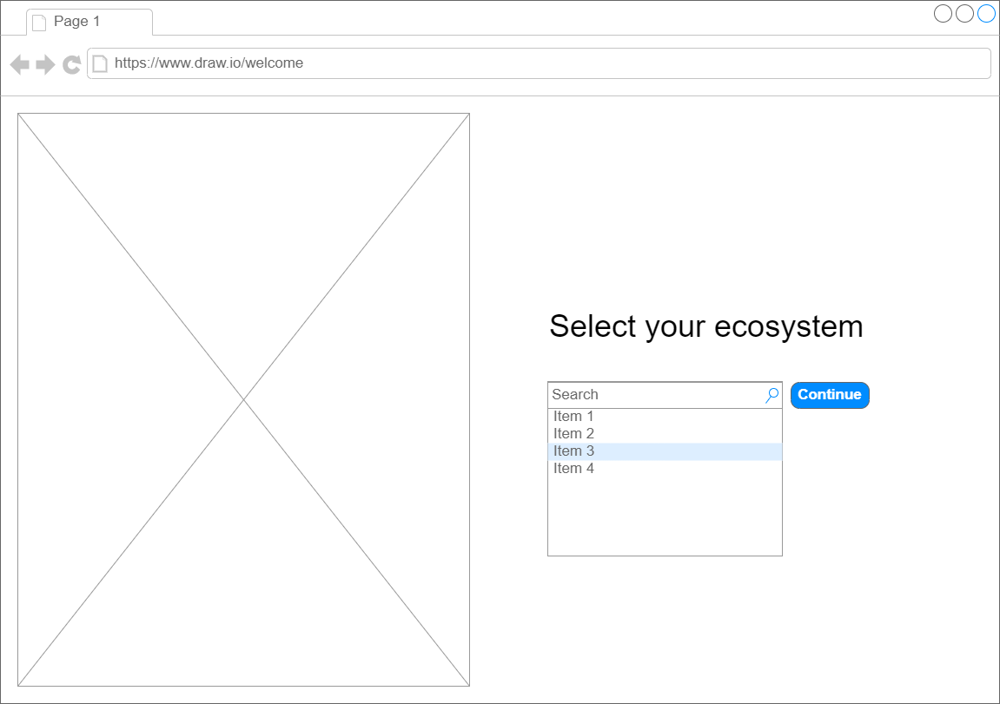

_Figure 1. Welcome page_

| #    | Feature                                   | Element      | Validation                                      |
|------|-------------------------------------------|--------------|-------------------------------------------------|
| F-01 | The user can search a list of dataspaces. | Search field | -                                               |
| F-02 | The user can select a dataspace.          | Drop down    | -                                               |
| F-03 | The user can submit the selection.        | Button       | The user MUST select one dataspace to continue. |

_Table 2. Features for the "welcome page" frame_

Notes:
- This screen is shown when entering the UI for the first time (i.e. no dataspace is configured) or on "add".

### Register company

If the company already has an identifier that is requested by the dataspace, this can be entered here. 

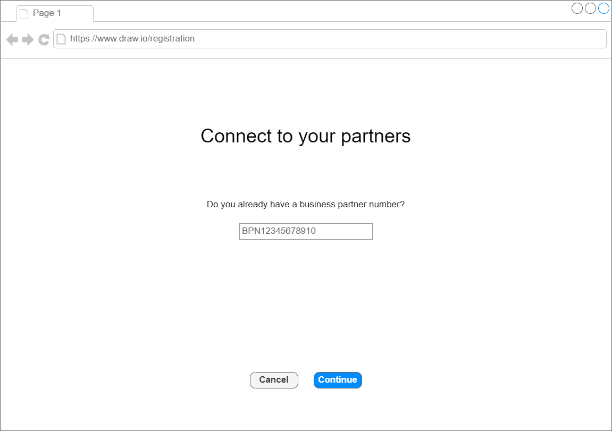

_Figure 2. Registration page_

| #    | Feature                                         | Element    | Validation              |
|------|-------------------------------------------------|------------|-------------------------|
| F-04 | The user can enter an identifier.               | Text field | This field is OPTIONAL. |
| F-05 | The user can continue the registration process. | Button     | -                       |
| F-06 | The user can cancel the registration process.   | Button     | -                       |

_Table 3. Features for the "registration page" frame_

Notes:
- The fields align with the ones required for the CX registration process. This view may look different for another dataspace.

#### Insert company data

The user can insert company data such as name and address.

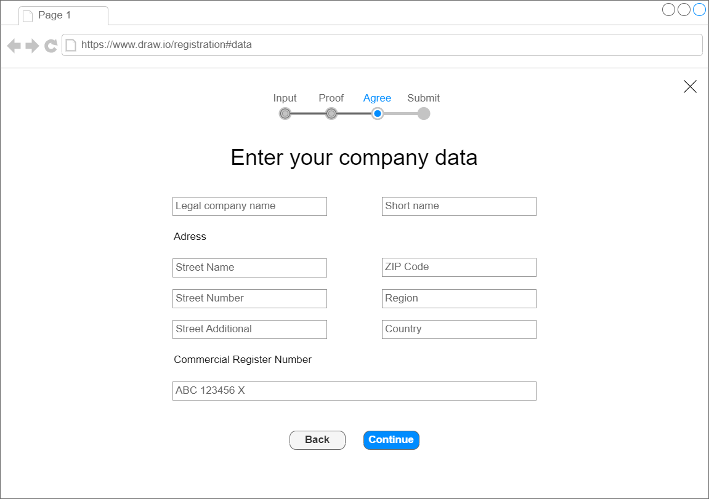

_Figure 3. Company data page_

| #    | Feature                                         | Element       | Validation                             |
|------|-------------------------------------------------|---------------|----------------------------------------|
| F-07 | The user can enter their company data.          | Text field(s) | The fields MUST be filled to continue. |
| F-08 | The user can continue the registration process. | Button        | -                                      |
| F-09 | The user can return to the previous page.       | Button        | -                                      |
| F-10 | The user can cancel the registration process.   | Button        | -                                      |

_Table 4. Features for the "company data page" frame_

Notes:
- The fields align with the ones required for the CX registration process. This view may look different for another dataspace.

#### Upload documents

The user can upload document to proof the company information, e.g., an extract from the commercial register.

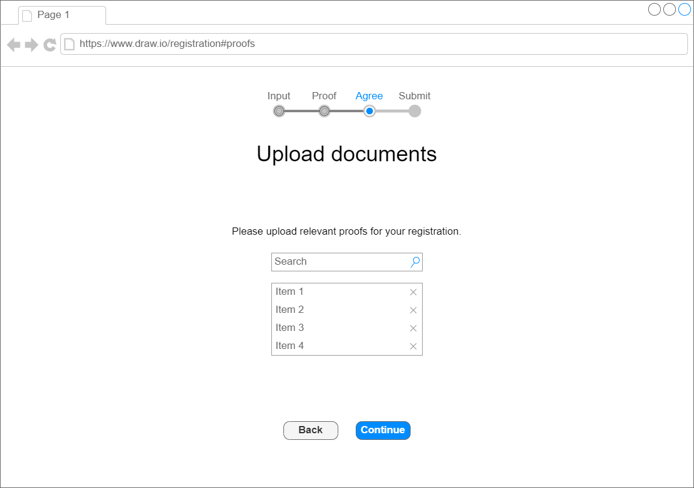

_Figure 4. Upload proofs page_

| #    | Feature                                         | Element      | Validation              |
|------|-------------------------------------------------|--------------|-------------------------|
| F-11 | The user can search their local file storage.   | Search field | -                       |
| F-12 | The user can upload one or many files.          | _Explorer_   | -                       |
| F-13 | The user can view their uploaded file(s).       | List         | This list MAY be empty. |
| F-14 | The user can continue the registration process. | Button       | -                       |
| F-15 | The user can return to the previous page.       | Button       | -                       |
| F-16 | The user can cancel the registration process.   | Button       | -                       |

_Table 5. Features for the "upload proofs page" frame_

Notes:
- The fields align with the ones required for the CX registration process. This view may look different for another dataspace.

#### Accept conditions

The user can view and accept the terms and conditions for the ecosystem participation.

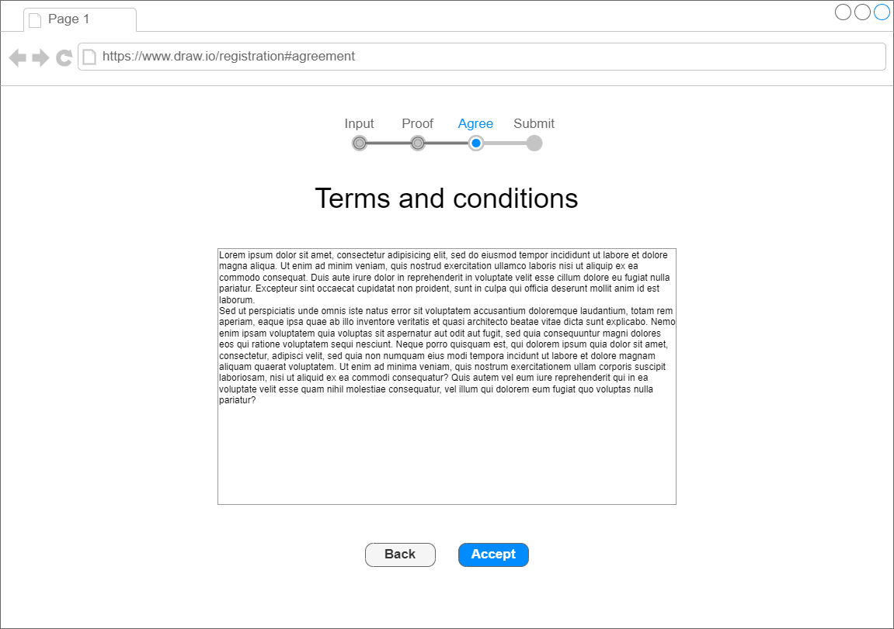

_Figure 5. Terms and conditions page_

| #    | Feature                                         | Element  | Validation                        |
|------|-------------------------------------------------|----------|-----------------------------------|
| F-17 | The user can read the terms and conditions.     | Text     | -                                 |
| F-18 | The user can provide their acceptance.          | Checkbox | This MUST be checked to continue. |
| F-19 | The user can continue the registration process. | Button   | -                                 |
| F-20 | The user can return to the previous page.       | Button   | -                                 |
| F-21 | The user can cancel the registration process.   | Button   | -                                 |

_Table 6. Features for the "terms and conditions page" frame_

Notes:
- The fields align with the ones required for the CX registration process. This view may look different for another dataspace.

#### Submit registration

The user can view a summary of the registration data and submit their registration.

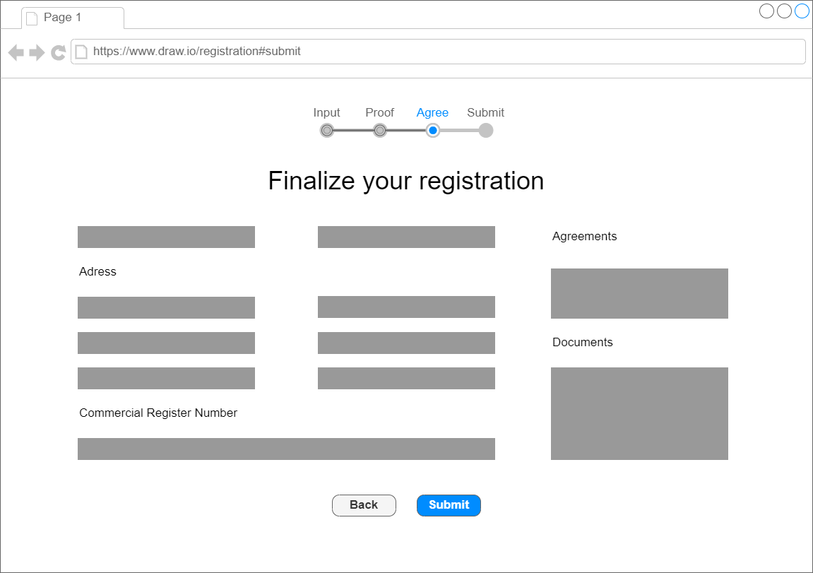

_Figure 6. Submission page_

| #    | Feature                                       | Element | Validation |
|------|-----------------------------------------------|---------|------------|
| F-22 | The user can view their registration data.    | Text    | -          |
| F-23 | The user can finish the registration process. | Button  | -          |
| F-24 | The user can return to the previous page.     | Button  | -          |
| F-25 | The user can cancel the registration process. | Button  | -          |

_Table 7. Features for the "terms and conditions page" frame_

Notes:
- The fields align with the ones required for the CX registration process. This view may look different for another dataspace.

## Manage ecosystem

### Manage memberships

#### Overview

The user can view network details (the ecosystem they participate in).

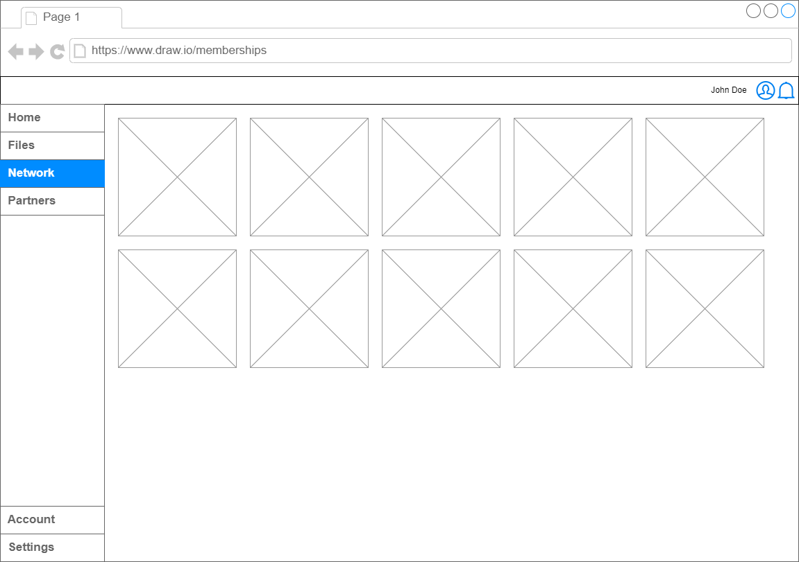

_Figure 7. Membership page_

| #    | Feature                                                                          | Element          | Validation |
|------|----------------------------------------------------------------------------------|------------------|------------|
| F-26 | The user can view the ecosystems they are participating in.                      | Tile             | -          |
| F-27 | The user can get a quick overview of names and status (active/pending/inactive). | Text             | -          |
| F-28 | The user can select an ecosystem for the membership details page.                | Interactive tile | -          |
| F-29 | The user can start a new registration.                                           | Interactive tile | -          |

_Table 8. Features for the "membership page" frame_

Notes:
- The last tile could be a "+" one, allowing to start the [registration process](#registration).

#### Details

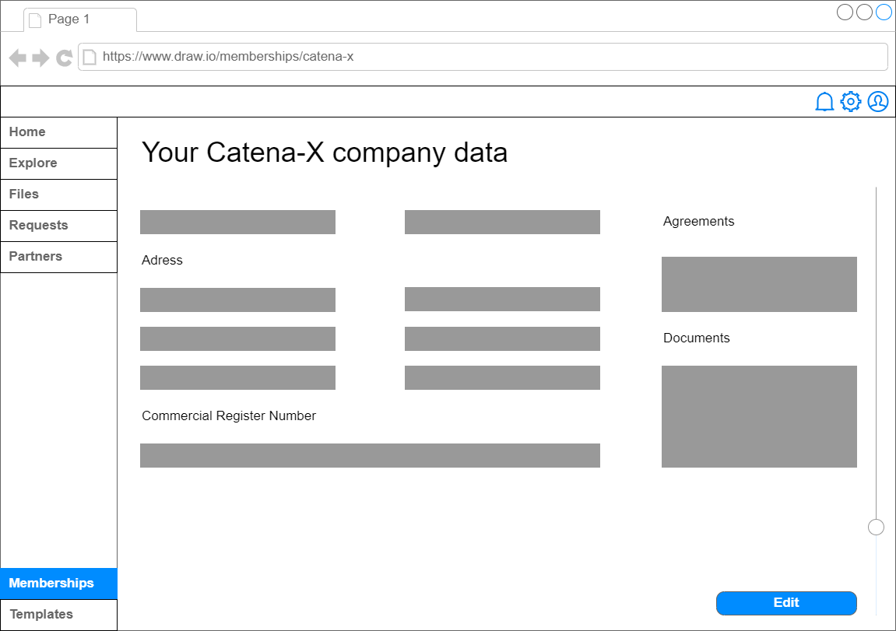

_Figure 8. Membership details page_

| #    | Feature                                       | Element | Validation |
|------|-----------------------------------------------|---------|------------|
| F-30 | The user can view their membership details.   | Text    | -          |
| F-31 | The user can edit their membership details.   | Button  | -          |

_Table 9. Features for the "membership details page" frame_

Notes:
- additional feature: request new credential(s), show status of credentials

### Manage partners

The user can add and view partner company details for quick selection in other views.

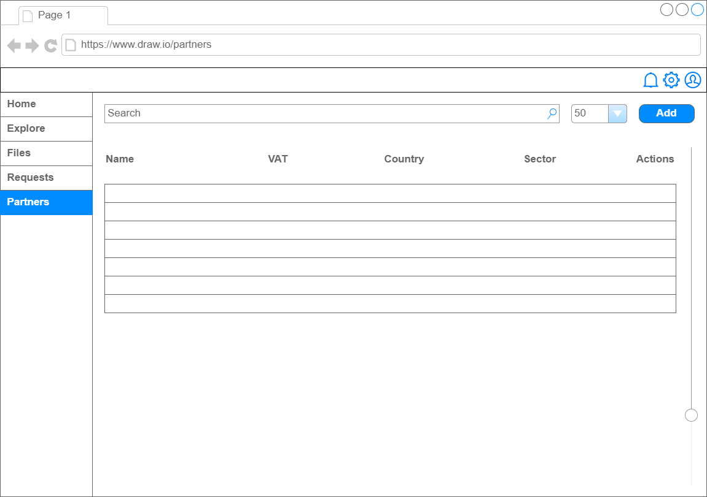

_Figure 9. Partner page_

Notes:
- This could be either a static list or a configurable; does it show only partners or all dataspace participants?

## Share data

### Use case selection

The user can navigate to main sub-pages and use-case-specific file uploads.

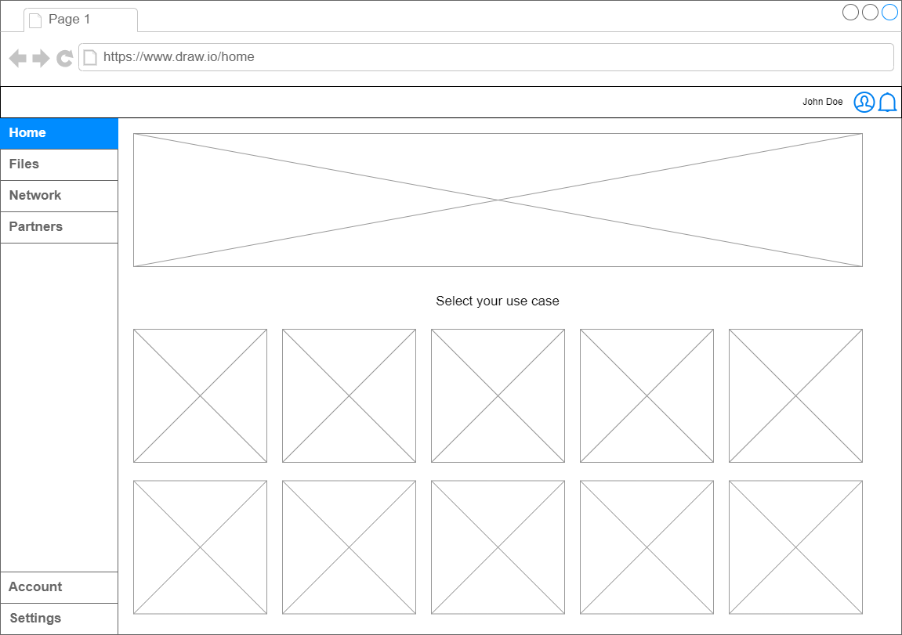

_Figure 10. Home page_

| #    | Feature                                      | Element                 | Validation |
|------|----------------------------------------------|-------------------------|------------|
| F-32 | The user can navigate to the main sub-pages. | Interactive tile/Button | -          |
| F-33 | The user can navigate to a use case dialog.  | Interactive tile/Button | -          |

_Table 10. Features for the "home page" frame_

Notes:
- A use case selection navigates to the file upload with pre-filled inputs.
- _(for demo)_ Tile for certificate management and selected use cases from Catena-X (just for demonstration purposes)

### View files

The user can see a list of provided (owned) and downloaded files with use case label and origin.

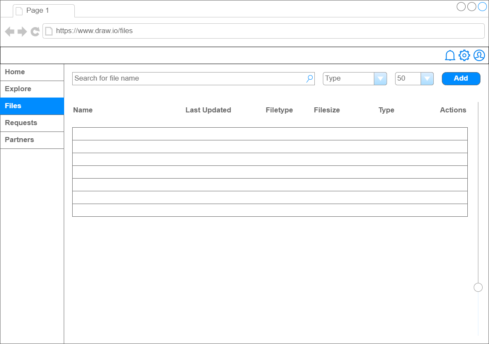

_Figure 11. Files page_

| #    | Feature                                       | Element      | Validation |
|------|-----------------------------------------------|--------------|------------|
| F-34 | The user can view their files.                | List         | -          |
| F-35 | The user can filter their files for metadata. | Search field | -          |
| F-36 | The user can explore more files.              | Button       | -          |

_Table 11. Features for the "files page" frame_

Notes: 
- This list includes owned and remote files (with access).
- The "tag" field expresses the dataspace

### Upload file

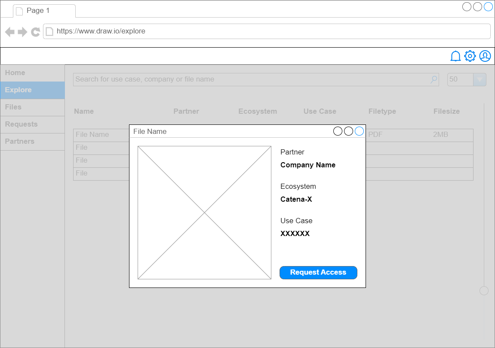

_Figure 12. Explore selection overlay_

| #    | Feature                                          | Element | Validation |
|------|--------------------------------------------------|---------|------------|
| F-37 | The user can select to upload one or many files. | Button  | -          |
| F-38 | The user can select to search the network.       | Button  | -          |
| F-39 | The user can close the view.                     | Button  | -          |

_Table 12. Features for the "explore selection overlay" frame_

For exploring the ecosystem, see [here](#discover-data-optional).

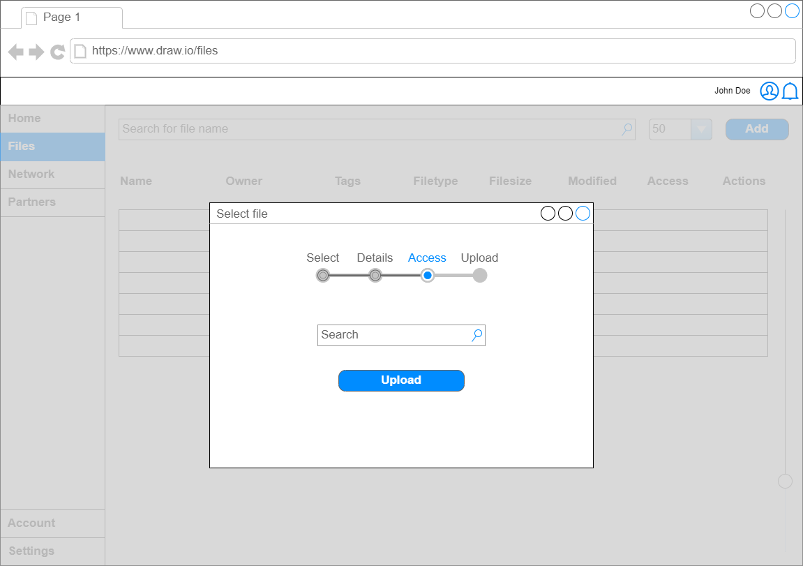

_Figure 13. Select file overlay_

| #    | Feature                                   | Element    | Validation                   |
|------|-------------------------------------------|------------|------------------------------|
| F-40 | The user can upload one or many files.    | _Explorer_ | -                            |
| F-41 | The user can view their uploaded file(s). | List       | This list MUST NOT be empty. |
| F-42 | The user can close the view.              | Button     | -                            |
| F-43 | The user can select continue.             | Button     | -                            |

_Table 13. Features for the "select file overlay" frame_

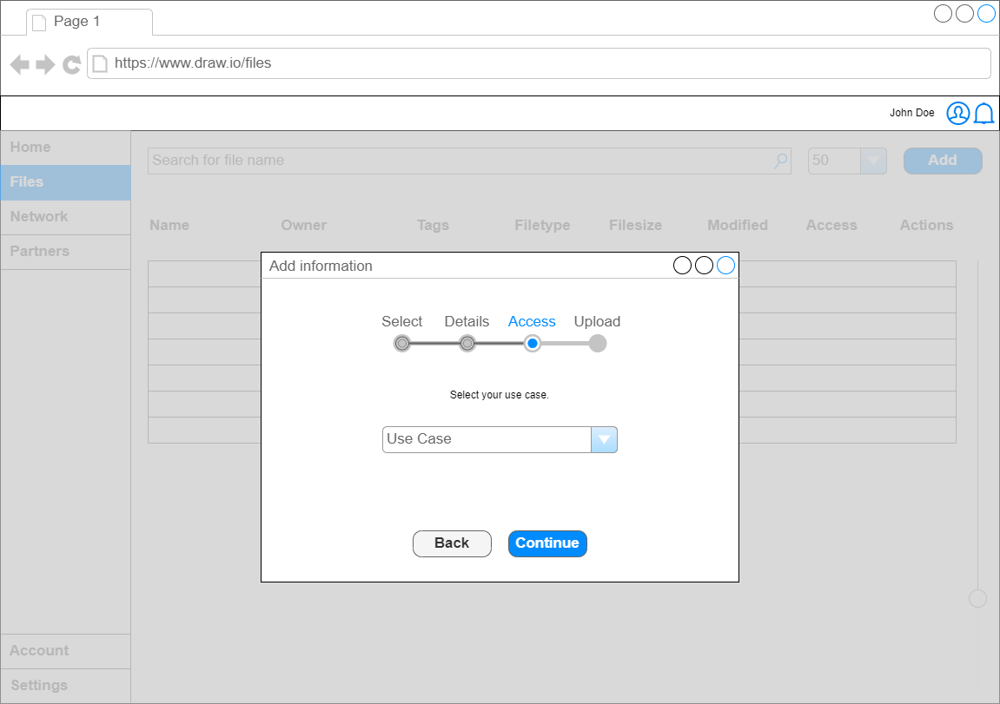

_Figure 14. Add details overlay_

| #    | Feature                                                        | Element    | Validation                   |
|------|----------------------------------------------------------------|------------|------------------------------|
| F-44 | The user can select a use case (if not preselected).           | Drop down  | This list MAY be empty.      |
| F-45 | The user can view their uploaded file(s).                      | List       | This list MUST NOT be empty. |
| F-46 | The user can close the view.                                   | Button     | -                            |
| F-47 | The user can select continue.                                  | Button     | -                            |
| F-48 | The user can return to the previous page.                      | Button     | -                            |

_Table 14. Features for the "add details overlay" frame_

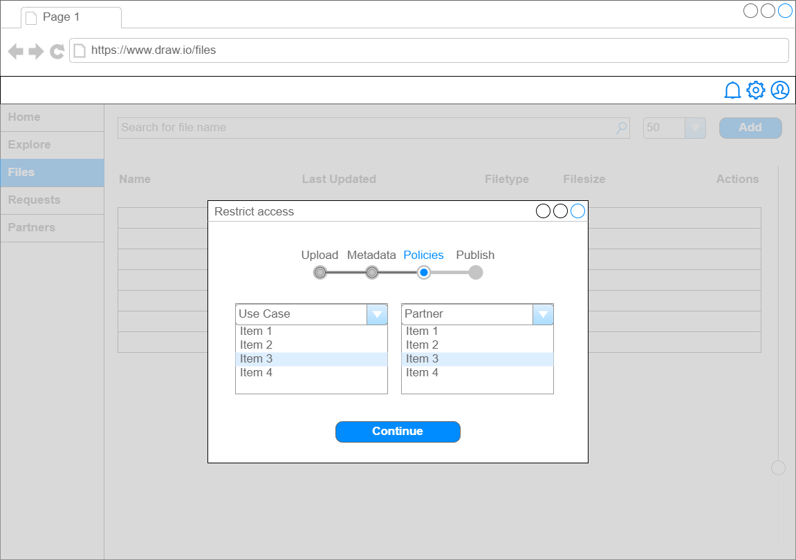

_Figure 15. Manage access overlay_

| #    | Feature                                              | Element   | Validation              |
|------|------------------------------------------------------|-----------|-------------------------|
| F-49 | The user can select a partner.                       | Drop down | This list MAY be empty. |
| F-50 | The user can close the view.                         | Button    | -                       |
| F-51 | The user can select continue.                        | Button    | -                       |
| F-52 | The user can skip this view.                         | Button    | -                       |
| F-53 | The user can return to the previous page.            | Button    | -                       |

_Table 15. Features for the "manage access overlay" frame_

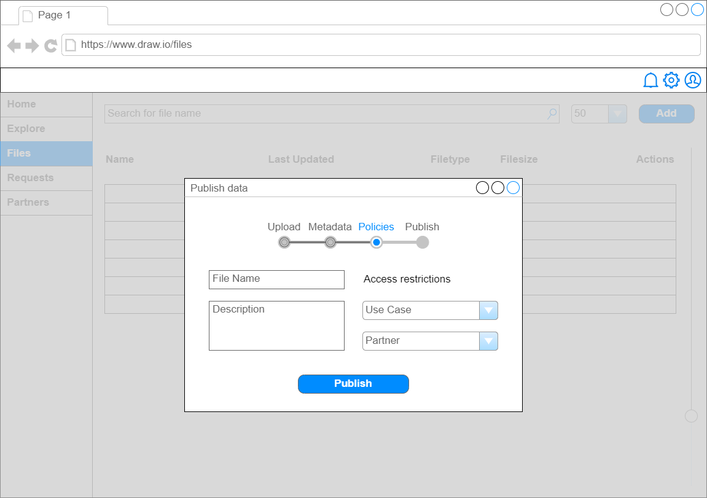

_Figure 16. Upload document overlay_

| #    | Feature                                   | Element | Validation |
|------|-------------------------------------------|---------|------------|
| F-54 | The user can view their document data.    | Text    | -          |
| F-55 | The user can close the view.              | Button  | -          |
| F-56 | The user can finish the document upload.  | Button  | -          |
| F-57 | The user can return to the previous page. | Button  | -          |

_Table 16. Features for the "upload document overlay" frame_

Notes:
- Contract and policy definition are not shown (they could be part of an admin page) 

### View file details

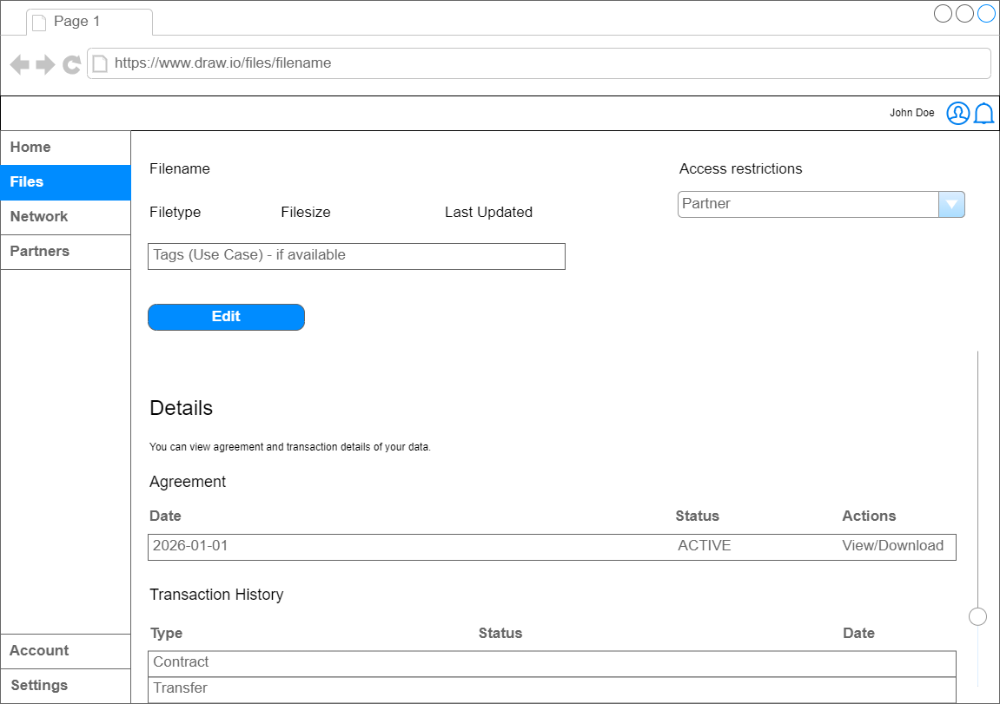

_Figure 17. File details page_

| #    | Feature                                   | Element | Validation |
|------|-------------------------------------------|---------|------------|
| F-58 | The user can view their document data.    | Text    | -          |
| F-59 | The user can view access restrictions.    | Text    | -          |
| F-60 | The user can edit their data.             | Button  | -          |
| F-61 | The user can view agreement details.      | Button  | -          |
| F-62 | The user can download the agreement.      | Button  | -          |
| F-63 | The user can vie the transaction history. | List    | -          |

_Table 17. Features for the "file details page" frame_

Notes:
- Show agreements and transfers per asset

## Discover data (optional)

The use can discover and download remote files.

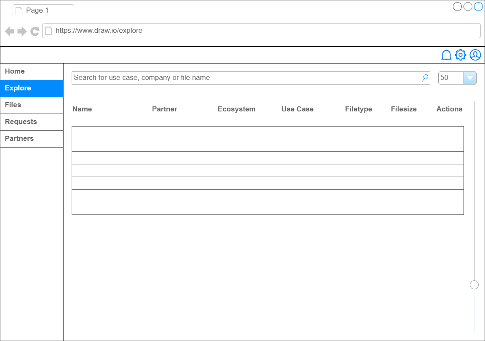

_Figure 9. Explore page_

| #    | Feature                                                           | Element      | Validation |
|------|-------------------------------------------------------------------|--------------|------------|
| F-64 | The user can view remote files.                                   | List         | -          |
| F-65 | The user can search for files by keywords, company, or file name. | Search Field | -          |
| F-66 | The user can filter the file list.                                | Dropdown     | -          |
| F-67 | The user can select an item for a details view.                   | Button       | -          |
| F-68 | The user can request access.                                      | Button       | -          |
| F-69 | The user can navigate to the file if they already have access.    | Button       | -          |

_Table 6. Features for the "explore page" frame_

Notes:
- Searches the entire ecosystem with a federated catalog (filter for company and use case).
- The "access" field indicates whether the user already has access to the data.
- The "request access" button becomes a "view file" one, when access has been already granted. The "view file" button switches to the ["files"](#view-files) view.
- Only simple metadata of the DCAT dataset is rendered.

## Notifications (optional)

The user can see incoming notifications as a popup. 

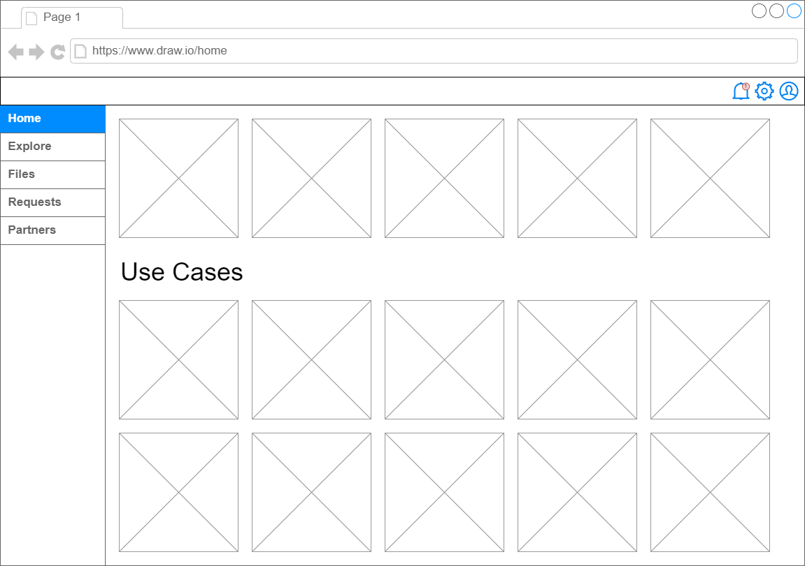

_Figure 9. Membership details page_

Notes: 
- Is triggered on incoming [notification request](implementation.md#notification). 